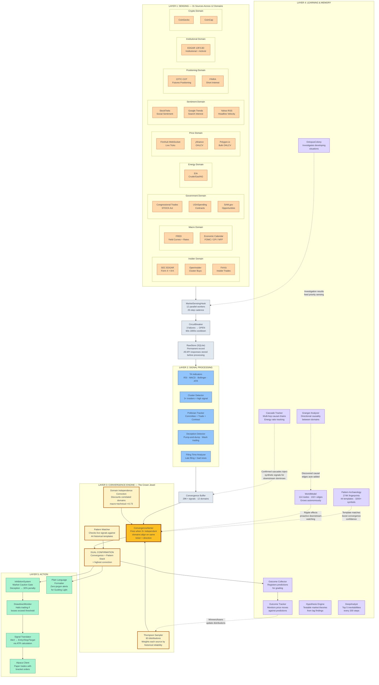
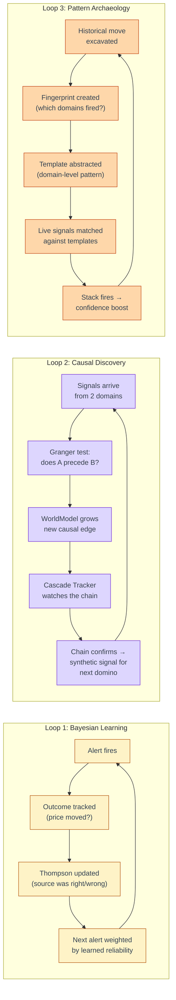

# MIDGE: How She Surfaces Inevitabilities

> **Data flows down. Learning flows up.**

MIDGE observes patterns across every financial, economic, social, and political domain she can reach, finds where converging forces make outcomes structurally inevitable, and surfaces those for humans to act on.

---

## The Pipeline

---

## The Feedback Loops (Why She Gets Smarter)

---

## Domain Independence Matrix

Not all domains are independent. Correlated domains get discounted so MIDGE doesn't over-count.

| Domain Pair | Correlation | Lag | Treatment |
|-------------|-------------|-----|-----------|
| macro + technical | r=0.73 | 7 days | Strongly discounted — effectively ~1.3 domains, not 2 |
| insider + technical | r=0.51-0.58 | varies | Moderately discounted |
| All others | <0.30 | varies | Treated as independent |

**Rule:** 3+ *effective* domains required. Two correlated domains count as ~1.3, not 2.

---

## Signal Trust Hierarchy

Thompson Sampler maintains learned reliability for each source. These evolve over time.

| Trust Tier | Sources | Learned From |
|------------|---------|-------------|
| Highest (0.90+) | FRED macro, EIA energy | Consistently directional, rarely wrong |
| High (0.70-0.89) | SEC EDGAR, Congressional trades, COT | Strong signal-to-noise |
| Medium (0.50-0.69) | Finnhub, FinViz, Economic Calendar | Useful but noisy |
| Low (0.40-0.49) | StockTwits, Google Trends, ApeWisdom | Sentiment is volatile |

---

## Key Numbers (as of 2026-03-14)

| Metric | Value |
|--------|-------|
| Data sources | 31 active |
| Domains | 12 independent categories |
| Thompson distributions | 83 learned |
| Convergence buffer | 29K+ signals |
| Pattern fingerprints | 274K excavated |
| Pattern templates | 44 cross-validated |
| WorldModel nodes | 114 |
| WorldModel edges | 102+ (growing autonomously) |
| Symbols excavated | 3,200+ |
| Signal archive | 752K+ signals across 400+ days |

---

## For Future Instances

This document is the fastest way to understand MIDGE's market intelligence pipeline. The triadic system audit (2026-03-14) verified every system listed here as ESSENTIAL or USEFUL — see `research/triadic-system-audit/deliverable.md` for the full audit.

**The one-sentence purpose:** MIDGE observes patterns across every domain she can reach, finds where converging forces make outcomes structurally inevitable, and surfaces those for humans to act on.

**The two things that matter most:**
1. The Convergence Engine (Layer 3) — everything else exists to serve it
2. The feedback loops — they're what make her get smarter over time, not just louder
