# What Happens When MIDGE Gets Data From an API

The full journey of a single API response — from raw data to a potential trade. Every box is a real system. Colors show status: green = active, amber = decision point, blue = core engine, grey = infrastructure.

```mermaid
flowchart TD
    subgraph INTAKE["1. Data Arrives"]
        API(["API Client Returns Data\n(e.g. SEC Form 4, FRED, Finnhub)"]):::input
        API -->|"raw response"| CB["Circuit Breaker\nBlocks source after\n3 consecutive failures"]:::infra
        CB -->|"passed"| RAW[("Raw Store\nSQLite — permanent\nrecord before processing")]:::infra
        CB -->|"source is OPEN"| BLOCK["Blocked\nWait for cooldown"]:::disabled
    end

    subgraph TRANSFORM["2. Raw Data Becomes a Signal"]
        RAW -->|"raw object"| ADAPT["Signal Adapter\n42 converters normalize\nto MarketSignal format"]:::support
        ADAPT -->|"MarketSignal"| ENRICH["Signal Enrichment\nVelocity detection +\nFiling time analysis"]:::support
        ADAPT -->|"below threshold"| DROP["Dropped\n(e.g. price change < 1.5%)"]:::disabled
    end

    subgraph FEED["3. Signal Enters the Brain"]
        ENRICH -->|"enriched signal"| BUF["Convergence Buffer\n29K+ signals across\n12 domains"]:::support
        ENRICH --> DEC["Deception Detector\nPump-and-dump +\nwash trading check"]:::active
        ENRICH --> ARCH[("Signal Archive\nJSONL per day\n752K+ total")]:::infra
        ENRICH --> OC["Outcome Collector\nPre-registers for\nfuture grading"]:::active
    end

    subgraph CONVERGENCE["4. Convergence Check — The Crown Jewel"]
        BUF --> PRUNE["Prune Stale Signals\nRemove beyond\ndomain window"]:::infra
        PRUNE --> COUNT{"3+ Independent\nDomains Agree?"}:::decision
        COUNT -->|"no (only 2)"| PARTIAL["Partial Convergence\nTriggers Focused Attention\nto fetch missing domain"]:::attention
        COUNT -->|"yes"| WEIGHT["Thompson-Weighted\nConfidence Calculation\n83 learned distributions"]:::core
        WEIGHT --> INDEP["Independence Correction\nDiscount correlated\ndomains (macro+tech r=0.73)"]:::support
        INDEP --> SEQ["Sequence Scoring\nDoes domain firing order\nmatch historical lags?"]:::support
        SEQ --> DEDUP{"Already Alerted\nThis Hour?"}:::decision
        DEDUP -->|"yes"| SUPP["Suppressed\n(deduplication)"]:::disabled
        DEDUP -->|"no"| ALERT[["Convergence Alert\nFires!"]]:::output
    end

    subgraph GATE["5. Paper Trading Gate — 7 Checks"]
        ALERT --> G1{"Confidence > 0.45\nStrength > 0.65?"}:::decision
        G1 -->|"no"| SKIP1["Skipped\n(too weak)"]:::disabled
        G1 -->|"yes"| G2{"Combo History\nWin Rate > 25%?"}:::decision
        G2 -->|"no"| SKIP2["Skipped\n(losing combo)"]:::disabled
        G2 -->|"yes"| G3{"Drawdown Monitor\n+ Risk Halt OK?"}:::decision
        G3 -->|"halted"| SKIP3["Blocked\n(drawdown limit)"]:::broken
        G3 -->|"ok"| G4{"Deception Caution\n< 30%?"}:::decision
        G4 -->|"too high"| SKIP4["Confidence penalized\nMay block"]:::attention
        G4 -->|"ok"| G5{"3 of 5 Validators\nAgree? (Law 7)"}:::decision
        G5 -->|"< 3"| DEFER["Deferred\n(needs more evidence)"]:::attention
        G5 -->|"3+ agree"| APPROVED[["Trade Approved"]]:::output
    end

    subgraph ACTION["6. Execution"]
        APPROVED --> PT["Paper Trade Logged\npaper_trades.jsonl"]:::active
        APPROVED --> PLAIN["Plain Language Alert\nalerts_human.jsonl\nZero-jargon for\nGuiding Light"]:::active
        APPROVED --> EXEC["Signal Translator\nEntry + Stop (1.5x ATR)\n+ Target (3x ATR)"]:::support
        EXEC --> ALP["Alpaca Paper Trade\nBracket order submitted\n(US equities only)"]:::active
    end

    %% FEEDBACK LOOPS — Learning flows back up
    OC -.->|"every 75 steps:\nwon/lost updates\ndistributions"| WEIGHT
    PARTIAL -.->|"boosts Thompson\nfor missing domain\nsources (2x, 1hr)"| API
    DEC -.->|"HAVEN flags\npenalize suspicious\nsources up to 20%"| WEIGHT

    classDef active fill:#2ecc71,stroke:#27ae60,color:#1a1a1a
    classDef broken fill:#e74c3c,stroke:#c0392b,color:#fff
    classDef disabled fill:#bdc3c7,stroke:#95a5a6,color:#7f8c8d,stroke-dasharray:5 5
    classDef attention fill:#e67e22,stroke:#d35400,color:#1a1a1a
    classDef fresh fill:#9b59b6,stroke:#8e44ad,color:#fff
    classDef core fill:#2980b9,stroke:#1a5276,color:#fff,stroke-width:3px
    classDef support fill:#3498db,stroke:#2471a3,color:#fff
    classDef infra fill:#ecf0f1,stroke:#bdc3c7,color:#2c3e50
    classDef decision fill:#f39c12,stroke:#d68910,color:#1a1a1a
    classDef input fill:#fed7aa,stroke:#c2410c,color:#1a1a1a
    classDef output fill:#a7f3d0,stroke:#047857,color:#1a1a1a
```

## The 5 Validators (Law 7 — Rule of 3)

At least 3 of these 5 must agree before a trade executes:

| Validator | What it checks | Source |
|-----------|---------------|--------|
| Convergence | The alert itself (always present) | ConvergenceAlerter |
| Pattern Stack | Historical template matches this ticker+direction | PatternWatcher (44 templates) |
| Inevitability | DeepAnalyst scored this as structurally inevitable | DeepAnalyst (every 200 steps) |
| Hypothesis | A tested market theory fired on this ticker recently | HypothesisEngine (RSI Layer 2) |
| Memory Precedent | 2+ winning precedents exist for this ticker | PatternMemory |

## Feedback Loops (How She Learns)

| Loop | What happens | Cadence |
|------|-------------|---------|
| Thompson Learning | Won/lost outcomes update source reliability distributions | Every 75 steps |
| Focused Attention | Partial convergence (2 domains) boosts fetch priority for missing domain sources | Immediate, 1hr expiry |
| HAVEN Trust | Deception detection penalizes suspicious source confidence by up to 20% | On deception event |
| Pattern Grading | Active Tracker grades confirmed/failed predictions, updates template win rates | Every 20 steps |

---

*For AI instances: This diagram covers `sensing_reactive.py` → `signal_adapters/` → `sensing_collector.py` → `convergence_detection.py` → `market_hooks_trades.py`. Node IDs map to code identifiers. Dashed arrows are feedback loops. Diamond shapes are decision gates.*
